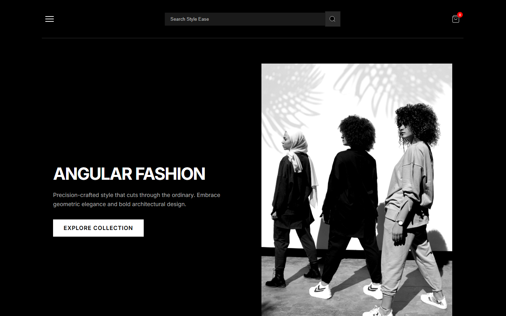

# Style Ease

[](https://github.com/lorenzodarioben-lgtm/style-ease/actions/workflows/ci.yml)

A responsive front-end fashion storefront built with Vue, Vue Router, and Vite.

## Live Demo

**[https://lorenzodarioben-lgtm.github.io/style-ease/](https://lorenzodarioben-lgtm.github.io/style-ease/)**

Deployed automatically from `main` with GitHub Actions and GitHub Pages.

## Screenshots

| Desktop                                                                | Mobile                                                                    |
| ---------------------------------------------------------------------- | ------------------------------------------------------------------------- |
|  |  |

## Overview

Style Ease is a single-page fashion storefront that demonstrates a complete browsing-to-checkout flow on the front end. It started as a static design and was rebuilt into a modular Vue and Vite application with automated quality checks, tests, and continuous deployment.

The storefront behaviour is **simulated**: the catalogue is bundled static data and the checkout flow does not process real payments. There is no backend, database, authentication, or real inventory. The focus of the project is front-end architecture, component structure, accessibility, responsive design, and a professional delivery pipeline.

## Key Features

- Product catalogue of 20 items rendered from local data
- Search by product name and description
- Filtering by category, size, colour, and price range, with multi-select chips and a clear-all control
- Client-side pagination of catalogue results
- Product-detail pages with size and colour selection, an "Add to Bag" action, and a wishlist toggle
- Expandable shipping and care sections on product pages
- Star-rating review form with submitted reviews saved per product in the browser's `localStorage`
- Shopping cart with add and remove, an item count, and an order total
- Checkout with inline validation, a payment-method selector, and an order-confirmation view
- Toast feedback when an item is added to the bag
- Mobile navigation menu and a route-aware header

## Accessibility and Responsive Behaviour

Accessibility work that is implemented in the source includes:

- A skip link to the main content and a focusable main landmark
- Visible keyboard focus styles
- Route-specific document titles and focus moved to the main region on navigation
- Semantic buttons, forms, fieldsets, and labelled controls
- `aria-expanded`, `aria-controls`, `aria-pressed`, and `aria-current` on interactive elements
- Polite live-region messages for cart, review, and validation feedback

The layout is responsive and was checked across mobile, tablet, and desktop widths (approximately 320–1440px) without horizontal overflow. These are deliberate accessibility improvements rather than a claim of full WCAG conformance, and they have not been validated with assistive-technology screen-reader testing.

## Technology Stack

- **Vue** – component-based UI (Options API with string templates)
- **Vue Router** – client-side routing with hash history
- **Vite** – development server and production build
- **Vitest** + **happy-dom** – unit and component testing
- **ESLint** – linting (flat config with the Vue plugin)
- **Prettier** – code formatting
- **GitHub Actions** – continuous integration and deployment
- **GitHub Pages** – hosting for the production build

## Project Structure

```
.
├── index.html               # Vite HTML entry point
├── vite.config.js           # Vite + Vitest config and production base path
├── eslint.config.js         # ESLint flat config
├── .github/workflows/       # CI and GitHub Pages deployment workflows
├── docs/images/             # README screenshots
└── src/
    ├── main.js              # App bootstrap (creates and mounts the app)
    ├── style.css            # Imports the CSS sections in cascade order
    ├── css/                 # Stylesheet sections
    └── js/
        ├── app.js           # Root component and shared cart/wishlist state
        ├── router.js        # Route definitions, titles, and focus handling
        ├── components/      # Reusable components (header, toast)
        ├── pages/           # Route-level pages
        ├── data/            # Catalogue and site content
        └── utils/           # Shared helpers (filtering, totals, storage)
```

## Automated Testing and Quality Checks

The suite currently has **39 tests across 8 test files**, covering product utilities, search and filtering, cart totals, text truncation, review storage fallbacks, wishlist and cart state, header accessibility, router titles and focus handling, and product-detail behaviour.

The tests focus on logic and component behaviour. They do not claim full coverage, and they do not cover visual rendering, real payments, or backend behaviour. Browser smoke testing is still useful after layout-sensitive changes.

`npm run validate` runs the full quality gate in sequence — formatting check, lint, tests, and production build — and is the same command used in continuous integration.

## Local Development

Requirements: Node.js 20 or newer and npm.

```sh
# Install dependencies
npm install

# Start the development server
npm run dev

# Build for production
npm run build

# Preview the production build locally
npm run preview
```

## Available npm Scripts

| Script                 | Description                                          |
| ---------------------- | ---------------------------------------------------- |
| `npm run dev`          | Start the Vite development server                    |
| `npm run build`        | Create the production build in `dist/`               |
| `npm run preview`      | Serve the production build locally                   |
| `npm run lint`         | Run ESLint                                           |
| `npm run format`       | Format supported files with Prettier                 |
| `npm run format:check` | Check formatting without writing changes             |
| `npm test`             | Run the test suite in watch mode                     |
| `npm run test:run`     | Run the test suite once                              |
| `npm run validate`     | Run format check, lint, tests, and build in sequence |

## Deployment

Pushes to `main` trigger two GitHub Actions workflows:

- **CI** (`.github/workflows/ci.yml`) runs on pull requests and pushes to `main`, installing with `npm ci` and running `npm run validate`.
- **Deploy** (`.github/workflows/deploy.yml`) runs on pushes to `main`, validates and builds the app, and publishes the generated output with the official GitHub Pages actions. Pull-request branches are never deployed.

The production build is served from the `/style-ease/` subpath, configured for production mode only in `vite.config.js`; local development and tests run at the root path. The build output is written to `dist/`, which is generated and not committed to the repository.

The application uses hash-based URLs (for example `…/style-ease/#/products`). This is a deliberate choice for GitHub Pages project sites: because Pages has no server-side single-page-app fallback, hash routing keeps direct links and page refreshes working without a custom 404 redirect.

## Current Limitations

These reflect the intended scope of a front-end demonstration:

- Front-end only — no backend, database, or server-side persistence
- No authentication or user accounts
- No real payment processing; checkout is simulated and ends at an order-confirmation view
- The catalogue is bundled static data, so there is no real inventory or stock tracking
- The cart and wishlist are held in memory and reset on a page refresh
- Product reviews persist only in the current browser via `localStorage`
- Product imagery is loaded from Unsplash and the Inter font from Google Fonts, so both depend on those external services
- URLs are hash-based for GitHub Pages compatibility

## Licence

Released under the [MIT Licence](LICENSE.txt).

Original design: [CodePen](https://codepen.io/Lorenzo-Ben/pen/OPPaqxx).
