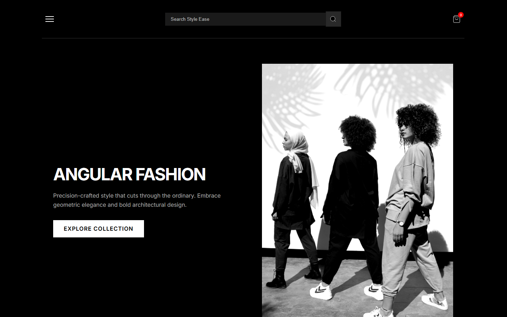

# Style Ease

[](https://github.com/lorenzodarioben-lgtm/style-ease/actions/workflows/ci.yml)

A responsive front-end fashion storefront built with Vue, Vue Router, and Vite.

## Live Demo

**[https://lorenzodarioben-lgtm.github.io/style-ease/](https://lorenzodarioben-lgtm.github.io/style-ease/)**

Deployed automatically from `main` with GitHub Actions and GitHub Pages.

## Screenshots

| Desktop                                                                | Mobile                                                                    |
| ---------------------------------------------------------------------- | ------------------------------------------------------------------------- |
|  |  |

## Overview

Style Ease is a single-page fashion storefront that demonstrates a complete browsing-to-checkout flow on the front end. It started as a static design and was rebuilt into a modular Vue and Vite application with automated quality checks, tests, and continuous deployment.

The storefront behaviour is **simulated**: the catalogue is bundled static data and the checkout flow does not process real payments. There is no backend, database, authentication, or real inventory. The focus of the project is front-end architecture, component structure, accessibility, responsive design, and a professional delivery pipeline.

## Key Features

- Product catalogue of 20 items rendered from local data
- Attribute-aware search across names, descriptions, categories, materials, colours, and sizes; URL-backed filters, sorting, pagination, and an in-stock-only filter can be bookmarked and restored
- Product-detail pages with size and colour selection, static demo stock, add-to-bag, variant-aware wishlist selections, and comparison controls
- Cart lines that preserve selected variants, link back to product details, expose their shared demo-stock capacity, merge matching quantities, enforce static stock limits, and can be saved for later without losing the cart line when saving fails
- Persisted cart, wishlist, comparison, recently viewed, and demo-receipt state with defensive browser-storage validation and cross-tab synchronization; delivery details are never persisted
- Dedicated accessible wishlist and side-by-side comparison workspaces, including a labelled header count for selected comparison styles
- Home-page recently viewed and explicitly curated featured-style sections that reuse the responsive product cards
- Expandable shipping and care sections on product pages
- Native-radio star-rating review form with browser-local, non-verified review summaries and newest/highest-rating ordering
- Two-step checkout with inline validation, accessible error announcements, a delivery-details review, and an explicit demo-order confirmation
- Browser-local demo order history and expandable, print-friendly demo receipts; delivery details are kept only for the current session
- Responsive product images with lazy loading, `srcset`, intrinsic sizing, and a visual fallback
- Route-level lazy loading with a retry UI and a one-time session-guarded recovery reload for failed route chunks
- Dedicated Page Not Found recovery route, while invalid product IDs retain their product-specific recovery screen
- Toast feedback when an item is added to the bag
- Mobile navigation menu and a route-aware header

## Accessibility and Responsive Behaviour

Accessibility work that is implemented in the source includes:

- A skip link to the main content and a focusable main landmark
- Visible keyboard focus styles
- Route-specific document titles and focus moved to the main region on navigation
- Semantic buttons, forms, fieldsets, and labelled controls
- `aria-expanded`, `aria-controls`, `aria-pressed`, and `aria-current` on interactive elements
- Polite live-region messages for cart, review, checkout validation, and empty states
- Keyboard-operable quantity, comparison, filter, checkout, and search-suggestion controls
- Predictable focus movement for opened filter panels and closed Quick Shop and size-guide dialogs
- Native keyboard-operable review radio controls, labelled comparison navigation state, and print-safe receipt actions

The layout is responsive and was checked across mobile, tablet, and desktop widths (approximately 320–1440px) without horizontal overflow. These are deliberate accessibility improvements rather than a claim of full WCAG conformance, and they have not been validated with assistive-technology screen-reader testing.

## Technology Stack

- **Vue** – component-based UI (Options API with string templates)
- **Vue Router** – client-side routing with hash history
- **Vite** – development server and production build
- **Vitest** + **happy-dom** – unit and component testing
- **ESLint** – linting (flat config with the Vue plugin)
- **Prettier** – code formatting
- **GitHub Actions** – continuous integration and deployment
- **GitHub Pages** – hosting for the production build

## Project Structure

```
.
├── index.html               # Vite HTML entry point
├── vite.config.js           # Vite + Vitest config and production base path
├── eslint.config.js         # ESLint flat config
├── .github/workflows/       # CI and GitHub Pages deployment workflows
├── docs/images/             # README screenshots
└── src/
    ├── main.js              # App bootstrap (creates and mounts the app)
    ├── style.css            # Imports the CSS sections in cascade order
    ├── css/                 # Stylesheet sections
    └── js/
        ├── app.js           # Root component and shared cart/wishlist state
        ├── router.js        # Route definitions, titles, and focus handling
        ├── components/      # Reusable components (header, toast)
        ├── pages/           # Route-level pages
        ├── data/            # Catalogue and site content
        └── utils/           # Shared helpers (filtering, totals, storage)
```

## Automated Testing and Quality Checks

The unit suite has **156 tests across 23 test files**, including mounted Vue component interactions through Vue Test Utils. It covers attribute search, URL state, availability filtering, defensive browser storage and cross-tab updates, variants and save-for-later, comparisons, review migration/summaries/order, receipt printing, router recovery, checkout, and image delivery. **Six Playwright scenarios** exercise the production build's purchase flow, direct URL state, accessible primary and not-found routes, keyboard shopping controls, and mobile overflow.

The tests focus on logic and component behaviour. They do not claim full coverage, and they do not cover visual rendering, real payments, or backend behaviour. Browser smoke testing is still useful after layout-sensitive changes.

`npm run validate` runs formatting, lint, unit tests, a production build, and the initial JavaScript/CSS gzip budgets. CI then runs the Playwright production-build suite separately.

## Local Development

Requirements: Node.js 20 or newer and npm.

```sh
# Install dependencies
npm install

# Start the development server
npm run dev

# Build for production
npm run build

# Preview the production build locally
npm run preview
```

## Available npm Scripts

| Script                 | Description                                           |
| ---------------------- | ----------------------------------------------------- |
| `npm run dev`          | Start the Vite development server                     |
| `npm run build`        | Create the production build in `dist/`                |
| `npm run preview`      | Serve the production build locally                    |
| `npm run lint`         | Run ESLint                                            |
| `npm run format`       | Format supported files with Prettier                  |
| `npm run format:check` | Check formatting without writing changes              |
| `npm test`             | Run the test suite in watch mode                      |
| `npm run test:run`     | Run the test suite once                               |
| `npm run test:e2e`     | Run production-build browser and accessibility checks |
| `npm run check:bundle` | Enforce initial JavaScript and CSS gzip budgets       |
| `npm run validate`     | Run format check, lint, tests, build, and budgets     |

## Deployment

Pushes to `main` trigger two GitHub Actions workflows:

- **CI** (`.github/workflows/ci.yml`) runs on pull requests and pushes to `main`, installing with `npm ci`, running `npm run validate`, and checking the production build with Playwright.
- **Deploy** (`.github/workflows/deploy.yml`) runs on pushes to `main`, validates and builds the app, and publishes the generated output with the official GitHub Pages actions. Pull-request branches are never deployed.

The production build is served from the `/style-ease/` subpath, configured for production mode only in `vite.config.js`; local development and tests run at the root path. The build output is written to `dist/`, which is generated and not committed to the repository.

The application uses hash-based URLs (for example `…/style-ease/#/products`). This is a deliberate choice for GitHub Pages project sites: because Pages has no server-side single-page-app fallback, hash routing keeps direct links and page refreshes working without a custom 404 redirect.

For implementation details and the browser-data boundaries, see [Architecture](docs/ARCHITECTURE.md).

## Current Limitations

These reflect the intended scope of a front-end demonstration:

- Front-end only — no backend, database, or server-side persistence
- No authentication or user accounts
- No real payment processing; checkout is simulated and ends at an order-confirmation view
- Catalogue stock is fixed demonstration data; there is no real inventory synchronization
- Cart, wishlist, comparisons, recently viewed products, and receipts persist only in the current browser and are not customer accounts; delivery details are not persisted
- Product reviews persist only in the current browser via `localStorage`
- Product imagery is loaded from Unsplash, so images depend on that external service; the Inter font is bundled with the application
- URLs are hash-based for GitHub Pages compatibility

## Licence

Released under the [MIT Licence](LICENSE.txt).

Original design: [CodePen](https://codepen.io/Lorenzo-Ben/pen/OPPaqxx).
